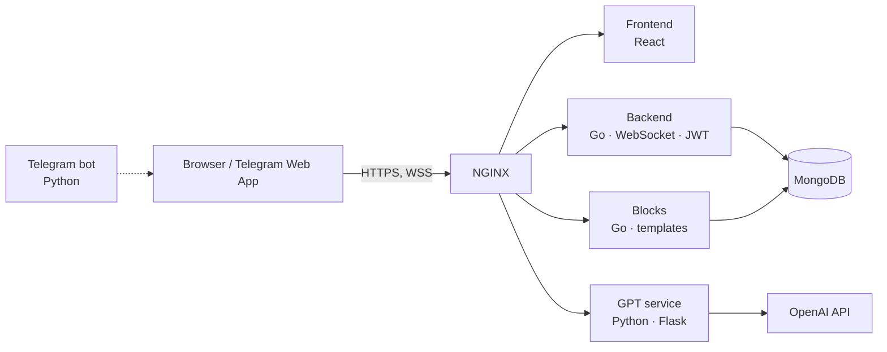

<p align="center">
  
</p>

<p align="center">
  <b>English</b> · <a href="README.ru.md">Русский</a> · <a href="README.zh-CN.md">中文</a>
</p>

<p align="center">
  
  
  
  
  
  
  
</p>

# D'art

**D'art** is a social network on an infinite canvas. Users move freely across it in any direction and place content of any kind as blocks — using ready-made templates, templates generated by an AI, or their own HTML.

## The idea

Mainstream social networks are built around a feed: an algorithm picks the content and authors have little control over presentation. D'art offers a different experience:

- **A canvas instead of a feed.** Content is laid out across an endless 2D space, and you decide where to look.
- **Any format.** Every block is an HTML page, so it can hold text, photos, CSS layouts and even interactive JavaScript.
- **Shared creativity.** The canvas is common to everyone, and every user adds to the bigger picture.
- **Personal zones.** A user can claim part of the canvas as a "zone" that only they can edit — like a channel or group, but with complete freedom of design.

## Features

| | |
|---|---|
| 🗺️ **Infinite canvas** | Scroll in any direction and pinch-zoom around your fingers, on mobile and desktop |
| 🧱 **HTML blocks** | Every block is HTML with CSS and JS, rendered right on the canvas |
| 🤖 **AI assistant** | Write a prompt and the model (GPT-4) returns a ready-made HTML block |
| 📚 **Template library** | Built-in templates (photo, text, etc.), user-made templates, likes and a popular list |
| 📍 **Zones** | Personal areas with custom colors, subscriptions and quick teleport |
| ⚡ **Real time** | Canvas changes reach all users instantly over WebSocket |
| 🛡️ **Admin panel** | Review and moderate blocks, zones, users and live connections |
| 💬 **Telegram** | A bot opens D'art as a Telegram Web App |

## Screenshots

<p align="center">
  
</p>
<p align="center"><i>Mobile: sign-in · canvas with content · blocks · adding a zone and a block</i></p>

<p align="center">
  
</p>
<p align="center"><i>Desktop: zone settings</i></p>

## Infinite scrolling

For D'art I built a custom infinite-canvas engine for React and React Native. It supports endless panning in any direction, zooming around the point between your fingers, and placing arbitrary content on the canvas. When it was written, no existing library offered this.

The server splits the canvas into coordinate-based "rooms". The client subscribes only to the rooms currently in view and receives just those blocks over WebSocket, so the canvas stays infinite while traffic stays bounded.

## Architecture



| Service | Stack | Role |
|---|---|---|
| `frontend` | React, react-spring, react-use-gesture, interact.js | Canvas, gestures, UI |
| `backend` | Go, gorilla/mux, gorilla/websocket, JWT, bcrypt | Auth, rooms, blocks, zones, WebSocket |
| `blocks` | Go | Uploading and serving template blocks (images, text) |
| `gpt` | Python, Flask, OpenAI SDK | Generating HTML blocks from a prompt |
| `telegram` | Python, pyTelegramBotAPI | Bot with a button that opens the Web App |
| `nginx` | NGINX | HTTPS and request routing |
| `mongo` | MongoDB | Storage |

## Getting started

You need Docker and Docker Compose.

```bash
git clone https://github.com/JGSnapp/D-art.git
cd D-art
cp .env.example .env     # fill in your keys
```

| Variable | Purpose |
|---|---|
| `OPENAI_API_KEY` | Key for the AI assistant |
| `BOT_TOKEN` | Telegram bot token from @BotFather |
| `JWT_SECRET` | Secret used to sign JWTs |
| `SMTP_*` | Mail settings for user emails (optional) |

Put a TLS certificate in `nginx/certs/fullchain.pem` and `nginx/certs/privkey.pem` (Let's Encrypt works). Set your domain in `nginx/default.conf` and in the frontend URLs, which currently point to `d-art.space`. Then run:

```bash
docker compose up --build
```

## Project layout

```
D-art/
├── frontend/   # React client
├── backend/    # Go: API, WebSocket, auth
├── blocks/     # Go: template block service
├── gpt/        # Python: HTML generation via GPT
├── telegram/   # Python: Telegram bot
├── nginx/      # Reverse proxy config
└── docs/       # README images
```

## Status

The project reached MVP stage (2023–2024): the web app works with its core feature set, and so does the Telegram bot. It is no longer under active development and is published as a portfolio piece.

## Presentation

[Project presentation (Google Slides, in Russian)](https://docs.google.com/presentation/d/1vsKxqgogZSflhaZ5qGd0nKBd2Ufv-vSGK6vAMeSha3E/edit?usp=sharing)

## License

This project is licensed under the [MIT License](LICENSE).
