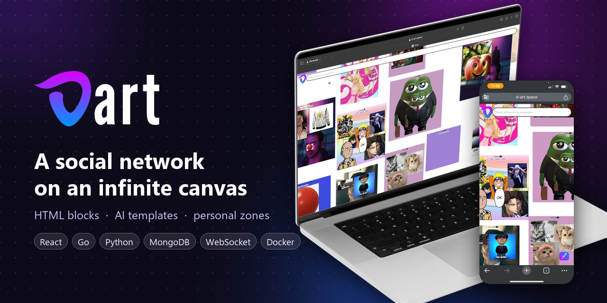
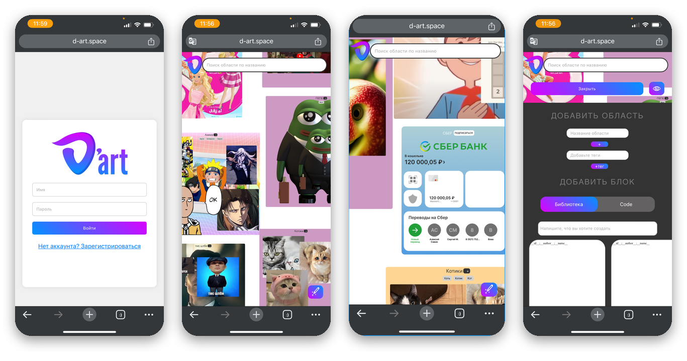
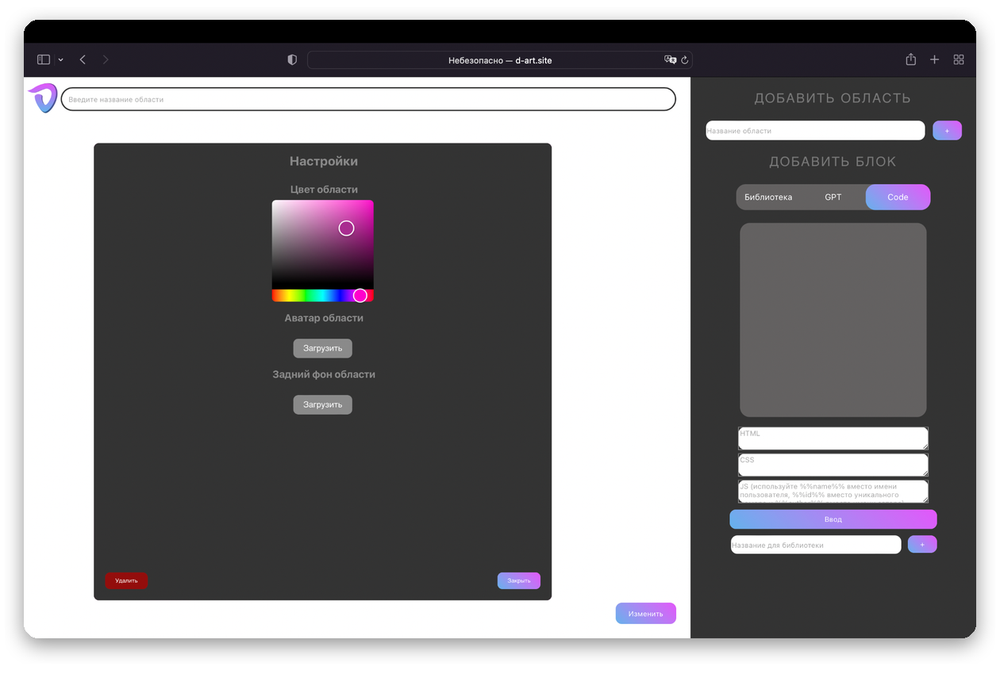
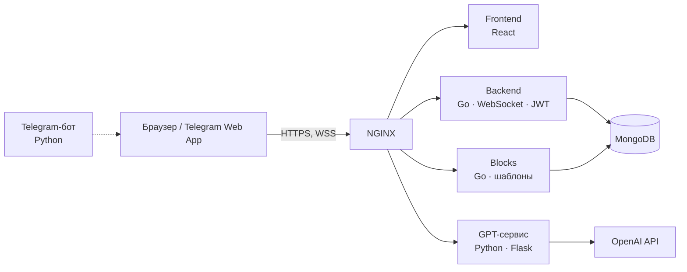

<p align="center">
  
</p>

<p align="center">
  <a href="README.md">English</a> · <b>Русский</b> · <a href="README.zh-CN.md">中文</a>
</p>

<p align="center">
  
  
  
  
  
  
  
</p>

# D'art

**D'art** — социальная сеть на бесконечной плоскости. Каждый пользователь может свободно перемещаться по ней в любом направлении и размещать контент любого формата в виде блоков: с помощью готовых шаблонов, шаблонов, сгенерированных нейросетью, или собственного HTML-кода.

## Идея

Привычные соцсети устроены как лента: контент выбирает алгоритм, а у автора почти нет свободы в оформлении. D'art предлагает другой опыт:

- **Плоскость вместо ленты.** Контент разложен по бесконечному двумерному пространству, и пользователь сам решает, куда смотреть.
- **Любой формат.** Каждый блок — это HTML-страница, поэтому в нём можно разместить текст, фото, верстку с CSS и даже интерактивные элементы на JS.
- **Совместное творчество.** Плоскость общая: каждый вносит вклад в общую «картину».
- **Свои области.** Пользователь может занять часть плоскости — «область», в пределах которой редактировать контент может только он. Это аналог канала или группы, но с полной свободой оформления.

## Возможности

| | |
|---|---|
| 🗺️ **Бесконечная плоскость** | Прокрутка в любую сторону и масштабирование жестами относительно положения пальцев — и на телефоне, и на десктопе |
| 🧱 **Блоки из HTML** | Любой блок — это HTML с CSS и JS, отображаемый прямо на плоскости |
| 🤖 **ИИ-помощник** | Пишешь промпт — нейросеть (GPT-4) возвращает готовый HTML-блок |
| 📚 **Библиотека шаблонов** | Готовые шаблоны (фото, текст и др.), пользовательские шаблоны, лайки и подборка популярных |
| 📍 **Области** | Личные зоны на плоскости с настраиваемыми цветами, подписками и быстрым переходом (телепортом) |
| ⚡ **Реальное время** | Изменения на плоскости приходят всем пользователям через WebSocket |
| 🛡️ **Админ-панель** | Просмотр и модерация блоков, областей, пользователей и активных подключений |
| 💬 **Telegram** | Бот открывает D'art как Telegram Web App |

## Скриншоты

<p align="center">
  
</p>
<p align="center"><i>Мобильная версия: вход · плоскость с контентом · блоки · добавление области и блока</i></p>

<p align="center">
  
</p>
<p align="center"><i>Десктопная версия: настройка области</i></p>

## Технология бесконечной прокрутки

В рамках D'art была написана собственная технология «бесконечной плоскости» для React и React Native: бесконечное перемещение в любую сторону, масштабирование относительно точки между пальцами и размещение на плоскости произвольного контента. На момент разработки готовых библиотек с подобной функциональностью не было.

Сервер делит плоскость на «комнаты» по координатам. Клиент подписывается только на те комнаты, которые сейчас в зоне видимости, и получает по WebSocket лишь нужные блоки — так плоскость остаётся бесконечной, а трафик ограниченным.

## Архитектура



| Сервис | Стек | Назначение |
|---|---|---|
| `frontend` | React, react-spring, react-use-gesture, interact.js | Плоскость, жесты, интерфейс |
| `backend` | Go, gorilla/mux, gorilla/websocket, JWT, bcrypt | Аутентификация, комнаты, блоки, области, WebSocket |
| `blocks` | Go | Загрузка и выдача шаблонных блоков (изображения, текст) |
| `gpt` | Python, Flask, OpenAI SDK | Генерация HTML-блоков по промпту |
| `telegram` | Python, pyTelegramBotAPI | Бот с кнопкой открытия Web App |
| `nginx` | NGINX | HTTPS, маршрутизация запросов |
| `mongo` | MongoDB | Хранилище |

## Запуск

Нужны Docker и Docker Compose.

```bash
git clone https://github.com/JGSnapp/D-art.git
cd D-art
cp .env.example .env     # заполните ключи
```

| Переменная | Для чего |
|---|---|
| `OPENAI_API_KEY` | Ключ для ИИ-помощника |
| `BOT_TOKEN` | Токен Telegram-бота от @BotFather |
| `JWT_SECRET` | Секрет для подписи JWT |
| `SMTP_*` | Почта для писем пользователям (необязательно) |

Положите TLS-сертификат в `nginx/certs/fullchain.pem` и `nginx/certs/privkey.pem` (например, от Let's Encrypt), укажите свой домен в `nginx/default.conf` и в адресах фронтенда (сейчас там `d-art.space`), затем:

```bash
docker compose up --build
```

## Структура

```
D-art/
├── frontend/   # React-клиент
├── backend/    # Go: API, WebSocket, авторизация
├── blocks/     # Go: сервис шаблонных блоков
├── gpt/        # Python: генерация HTML через GPT
├── telegram/   # Python: Telegram-бот
├── nginx/      # Конфигурация реверс-прокси
└── docs/       # Изображения для README
```

## Статус

Проект доведён до стадии MVP (2023–2024): работают веб-приложение с базовым набором функций и Telegram-бот. Дальше проект не развивается и опубликован как портфолио.

## Презентация

[Презентация проекта (Google Slides)](https://docs.google.com/presentation/d/1vsKxqgogZSflhaZ5qGd0nKBd2Ufv-vSGK6vAMeSha3E/edit?usp=sharing)

## Лицензия

Проект распространяется под лицензией [MIT](LICENSE).
