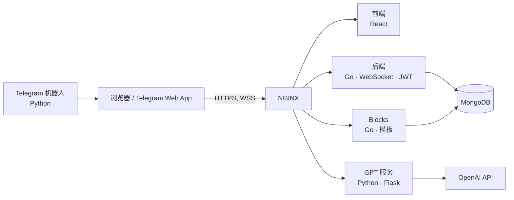

<p align="center">
  
</p>

<p align="center">
  <a href="README.md">English</a> · <a href="README.ru.md">Русский</a> · <b>中文</b>
</p>

<p align="center">
  
  
  
  
  
  
  
</p>

# D'art

**D'art** 是一个建立在无限画布上的社交网络。用户可以在画布上向任意方向自由移动，并以"区块"的形式发布任何类型的内容：可以使用现成模板、由 AI 生成的模板，也可以直接编写自己的 HTML。

## 理念

主流社交网络大多以信息流为核心：内容由算法挑选，创作者对呈现方式几乎没有掌控权。D'art 提供了一种不同的体验：

- **用画布取代信息流。** 内容分布在无边无际的二维空间中，看哪里由你自己决定。
- **任意格式。** 每个区块都是一个 HTML 页面，可以包含文字、图片、CSS 排版，甚至 JavaScript 交互。
- **共同创作。** 画布对所有人开放，每位用户都在为整幅"画面"添砖加瓦。
- **个人区域。** 用户可以占据画布的一部分作为自己的"区域"，只有本人可以编辑其中的内容——类似频道或群组，但设计完全自由。

## 功能

| | |
|---|---|
| 🗺️ **无限画布** | 在手机和电脑上都能向任意方向滚动，并以手指位置为中心缩放 |
| 🧱 **HTML 区块** | 每个区块都是包含 CSS 和 JS 的 HTML，直接渲染在画布上 |
| 🤖 **AI 助手** | 输入提示词，模型（GPT-4）即返回可直接使用的 HTML 区块 |
| 📚 **模板库** | 内置模板（图片、文字等）、用户自制模板、点赞与热门榜单 |
| 📍 **区域** | 个人专属区域，支持自定义配色、订阅和快速传送 |
| ⚡ **实时同步** | 画布上的变化通过 WebSocket 即时推送给所有用户 |
| 🛡️ **管理后台** | 查看和管理区块、区域、用户及在线连接 |
| 💬 **Telegram** | 通过机器人以 Telegram Web App 的形式打开 D'art |

## 截图

<p align="center">
  
</p>
<p align="center"><i>移动端：登录 · 带内容的画布 · 区块 · 添加区域和区块</i></p>

<p align="center">
  
</p>
<p align="center"><i>桌面端：区域设置</i></p>

## 无限滚动技术

为了 D'art，我为 React 和 React Native 自主开发了一套"无限画布"引擎：支持向任意方向无限平移、以双指中点为中心缩放，以及在画布上放置任意内容。开发时，市面上还没有提供类似功能的库。

服务器按坐标将画布划分为若干"房间"。客户端只订阅当前视野内的房间，并通过 WebSocket 仅接收这些房间里的区块——画布无限延伸，流量却始终可控。

## 架构



| 服务 | 技术栈 | 作用 |
|---|---|---|
| `frontend` | React、react-spring、react-use-gesture、interact.js | 画布、手势、界面 |
| `backend` | Go、gorilla/mux、gorilla/websocket、JWT、bcrypt | 认证、房间、区块、区域、WebSocket |
| `blocks` | Go | 上传与分发模板区块（图片、文字） |
| `gpt` | Python、Flask、OpenAI SDK | 根据提示词生成 HTML 区块 |
| `telegram` | Python、pyTelegramBotAPI | 带有打开 Web App 按钮的机器人 |
| `nginx` | NGINX | HTTPS 与请求路由 |
| `mongo` | MongoDB | 数据存储 |

## 快速开始

需要安装 Docker 和 Docker Compose。

```bash
git clone https://github.com/JGSnapp/D-art.git
cd D-art
cp .env.example .env     # 填写密钥
```

| 变量 | 用途 |
|---|---|
| `OPENAI_API_KEY` | AI 助手使用的密钥 |
| `BOT_TOKEN` | 从 @BotFather 获取的 Telegram 机器人令牌 |
| `JWT_SECRET` | 用于签名 JWT 的密钥 |
| `SMTP_*` | 向用户发送邮件的邮箱配置（可选） |

将 TLS 证书放到 `nginx/certs/fullchain.pem` 和 `nginx/certs/privkey.pem`（可使用 Let's Encrypt）。在 `nginx/default.conf` 和前端地址中填写你自己的域名（目前为 `d-art.space`），然后运行：

```bash
docker compose up --build
```

## 目录结构

```
D-art/
├── frontend/   # React 客户端
├── backend/    # Go：API、WebSocket、认证
├── blocks/     # Go：模板区块服务
├── gpt/        # Python：通过 GPT 生成 HTML
├── telegram/   # Python：Telegram 机器人
├── nginx/      # 反向代理配置
└── docs/       # README 配图
```

## 项目状态

项目已完成 MVP 阶段（2023–2024）：具备核心功能的 Web 应用和 Telegram 机器人均可正常运行。目前已不再积极开发，作为作品集公开发布。

## 演示文稿

[项目演示文稿（Google Slides，俄语）](https://docs.google.com/presentation/d/1vsKxqgogZSflhaZ5qGd0nKBd2Ufv-vSGK6vAMeSha3E/edit?usp=sharing)

## 许可证

本项目基于 [MIT 许可证](LICENSE) 开源。
